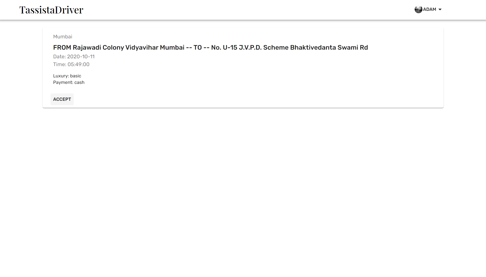

# Tassista  
 Tassista is a webapp that i am working on in the Unicode learning period.
 This app is divided in tasks. The following is the list of tasks :
- [x] First Task - Add Oauth and JWT Authentication for two types of users
- [x] Second Task - Add request model and maps for users and drivers

-------------------------------------------------

## The Tech Stack 

### Client Side :
| Package | Version |
|--------|--------|
| React  | v16.13.1|
| Material-UI |  v4.11.0|
| Material Icons |  v4.9.1|
| react-google-maps |  v1.10.1|
| use-places-autocomplete | v1.5.2|


### Server Side:
| Package | Version |
|--------|--------|
| Express  | v4.17.1|
| Mongoose  |v5.10.0|
| Passport   |v0.4.1|
| Concurrently|  v5.3.0|

---------------------------------------------------------------

## Preview
### Home Screen / Landing Page


### Authentication

**Register:**

##### Users and Drivers can register using their existing Google accounts or have a new account registered


**Login:**

##### Users and Drivers have their separate collections from which they are chosen and authorized based on input credentials. The form is validated on input stream.

 

### User Profile

**Profile Page for both driver and user :**

 
 

### Requesting For Rides

**User side**
##### The user can make new ride request and edit older requests but can only make one request at a time. The Autocomplete material ui component used for autocomplete and suggestions are provided from use-places-autocomplete hook. The time of ride can also be changed to personal preference.


----------------------------------------------------------


#### Driver side
##### The driver can look at all the pending requests from the users in a given radius and can choose to accept any ONE request. The accepted request is then showed to the driver with the user info and the pickup and drop locations are marked on the map


-----------------------------------------------------------------




---------------------------------------------------------------

## APIs used for the application 

- [Google JavaScript Maps API](https://developers.google.com/maps/documentation/javascript/overview) 
- [Google Places API](https://developers.google.com/places/web-service/overview)
- [Google Fonts API](https://fonts.google.com/)

----------------------------------------------------------------------

## To run this project in your environment
Run the following commands in the project directory:

```
cd client
npm install
cd ../server
npm install
npm run dev
```